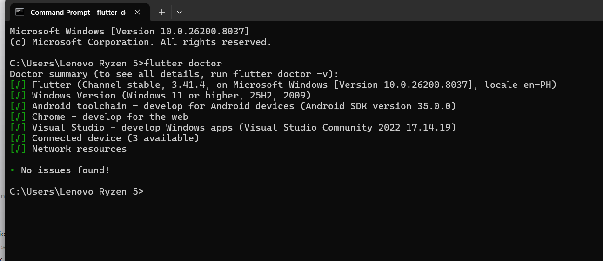

# INVENTORY MANAGEMENT SYSTEM

whats currently done:
- Authentication (Login and Signup w/ database)

To be done:

GUI and Logic and DB
- Adding form
- Inventory
- Purchase
- History / Trasaction
- Settings

---


Make sure youve successfully installed and set up flutter. Once you've installed it, go to Command Line and type ```flutter doctor```. You should see **No Issues Found**.



***To my dear classmates:***

to run the app in debug mode: open the project on VSCode then open terminal using ```CTRL + SHIFT + ~```. Then connect your phone to your Laptop via USB. Make sure you turned on the ```Developer Mode``` go to ```Developer Options``` turn on ```USB debugging``` and turn on ```Install via USB```

After you've done that, go back in your vscode terminal and type ```flutter pub get``` once this finished, type ```flutter run```

Turn on your laptop wifi, as it will download the project packages needed for running the debug session in your phone. Wait for a while. Once it finished downloading and setting up the downloads, a pop up alert will show on your phone. It will ask you whether you want to install the apk package on your phone. Click ok or confirm.

Once the app has been installed, you can then make changes in the app while on debug mode. You can code then save the changes youve make using ```Ctrl + S``` then hit ```r``` on the terminal, the changes, shall be reflected in the app in your phone.

Once you have made changes and you can then commit it to github.

**Note:** 
    You dont have to turn on your Laptop's wifi every time you run the command ```flutter run```. But you need to turn it on if you are running this project for the very first time or if you have added a flutter package in the project.


